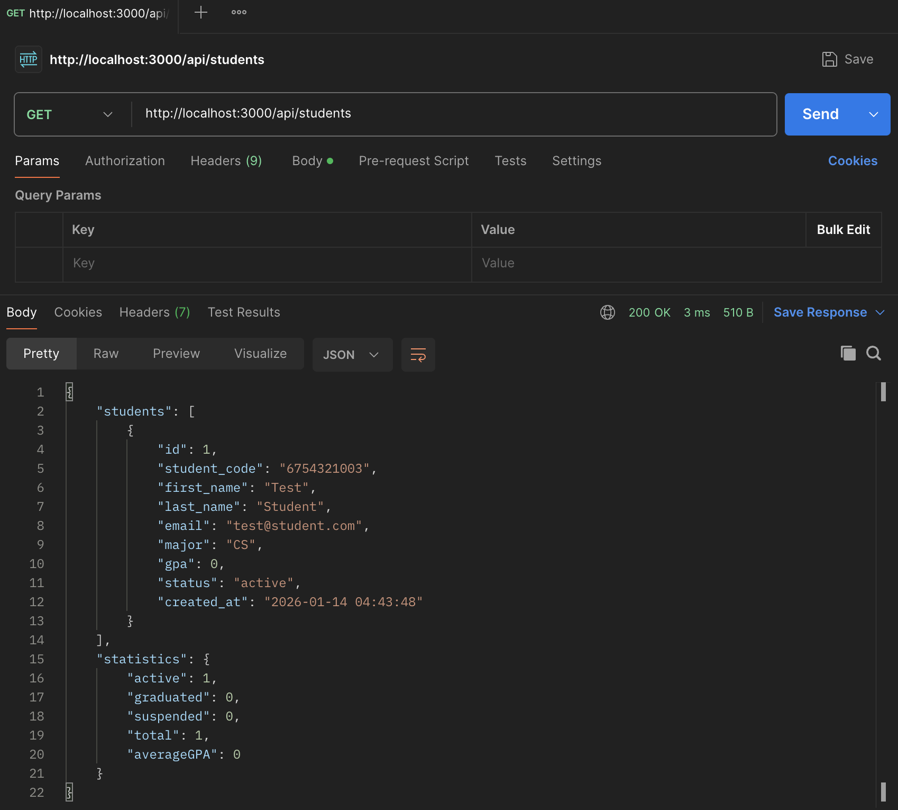
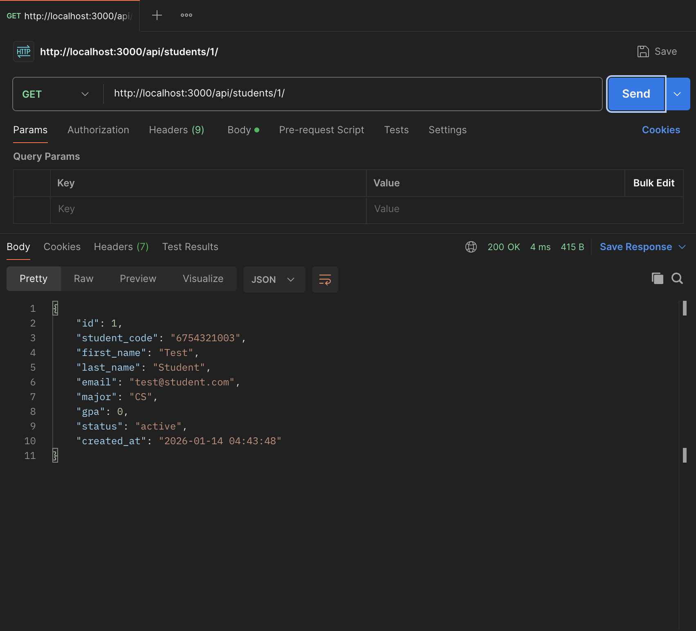
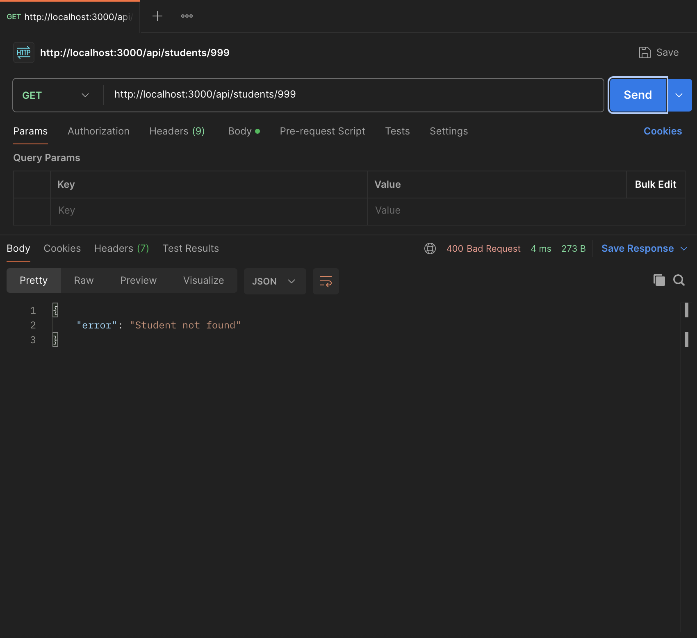
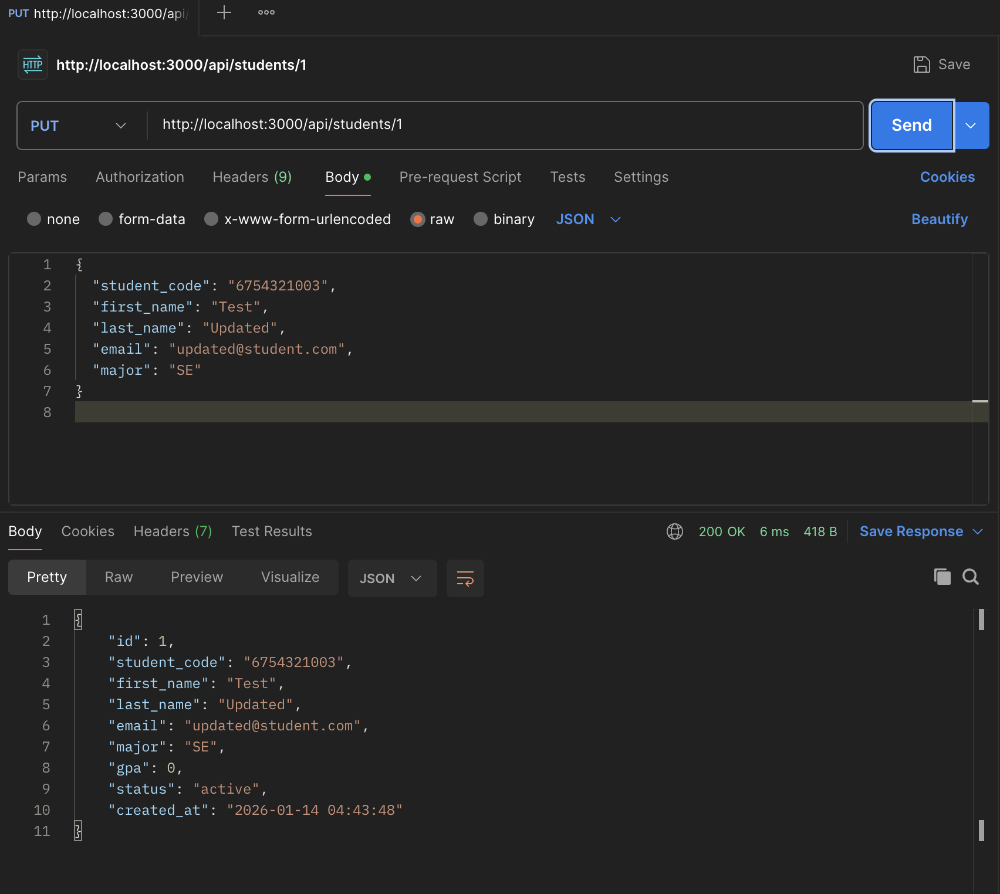
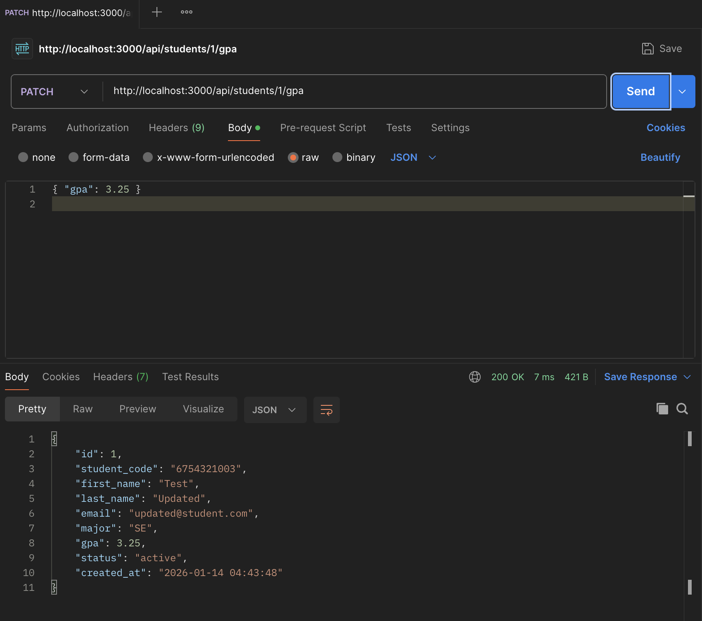
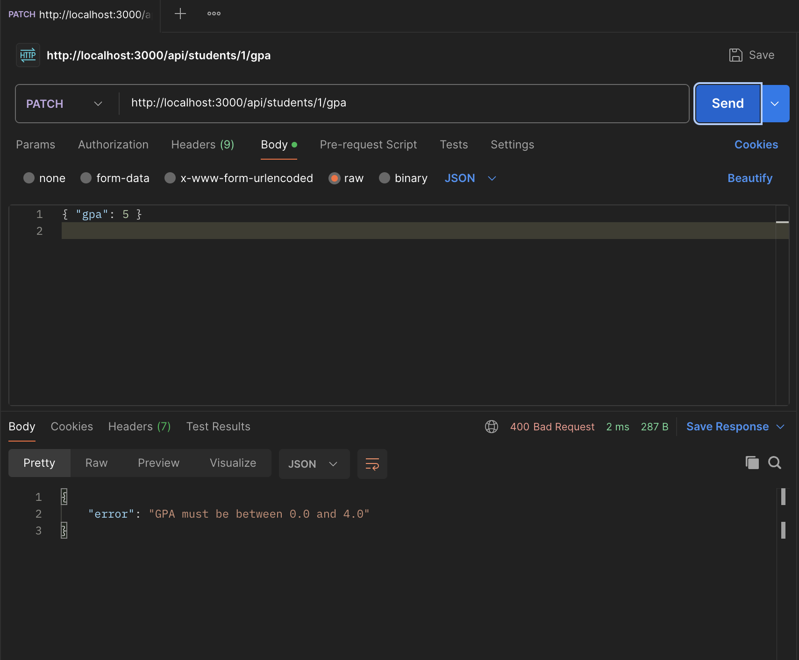
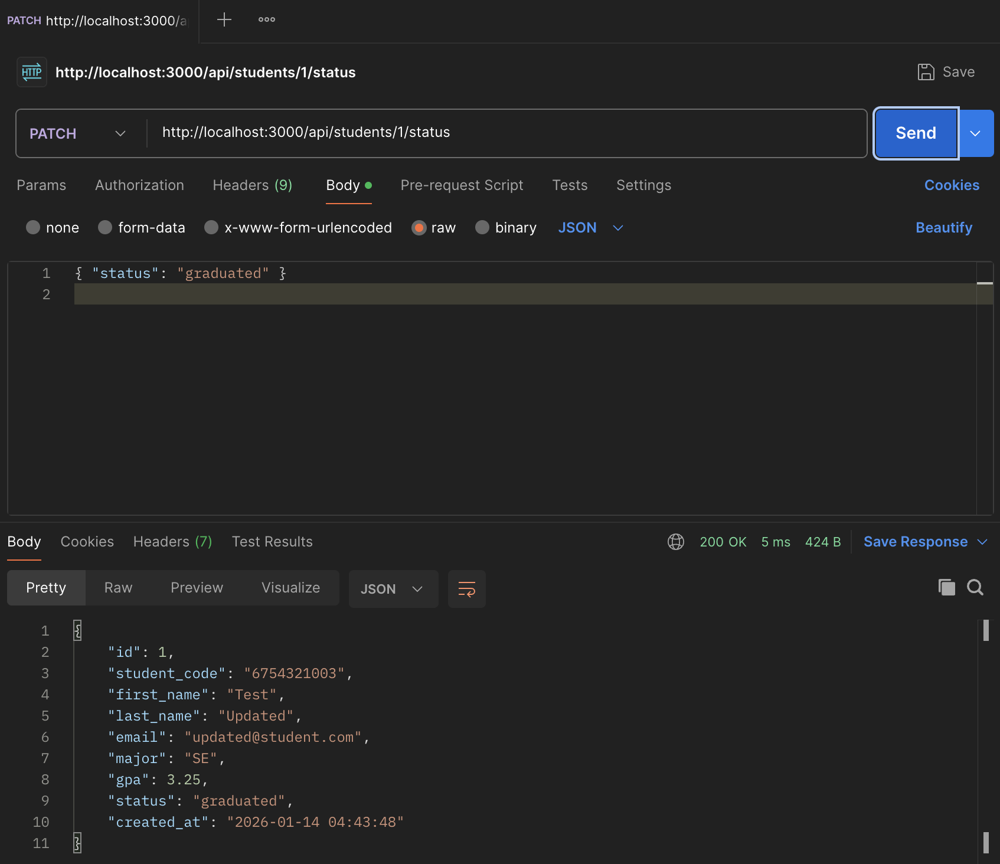
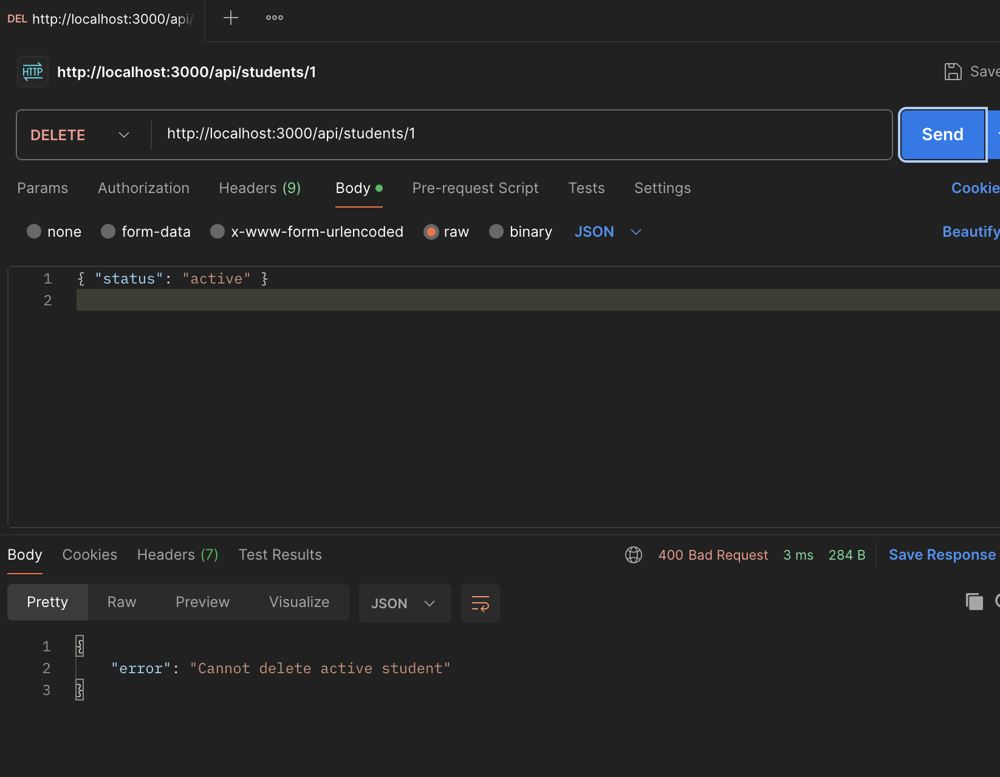
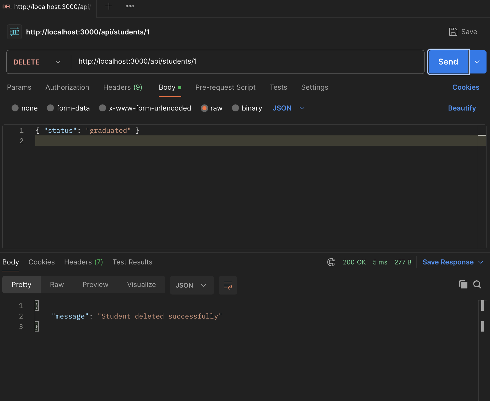
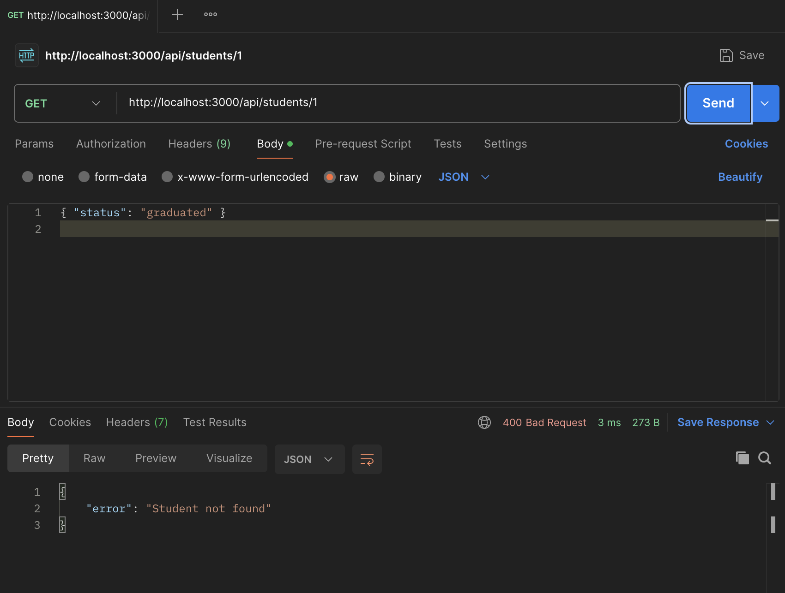

# Student Management System - Layered Architecture

## 📋 Project Information
- **Student Name:** บวรรัตน์ ศิริเมือง
- **Student ID:** 67543210036-9
- **Course:** ENGSE207 Software Architecture
- **Exam:** Midterm Practical Exam (Individual)

---

## 🏗️ Architecture Style
**Layered Architecture (3-tier)**

ระบบถูกออกแบบใหม่จาก Monolithic ให้เป็น Layered Architecture เพื่อแยกความรับผิดชอบของแต่ละส่วนอย่างชัดเจน

---

## 📂 Project Structure

midterm-individual-67543210036-9/
├── src/
│ ├── presentation/ # Presentation Layer
│ │ ├── routes/ # HTTP Routes
│ │ ├── controllers/ # Controllers (Request/Response)
│ │ └── middlewares/ # Error handling
│ │
│ ├── business/ # Business Logic Layer
│ │ ├── services/ # Business rules
│ │ └── validators/ # Validation logic
│ │
│ └── data/ # Data Access Layer
│ ├── repositories/ # Database queries
│ └── database/ # Database connection
│
├── server.js # Entry point
├── students.db # SQLite database
├── README.md
└── ARCHITECTURE.md

yaml
Copy code

---

## 🎯 Refactoring Summary

### 🔴 Problems in Monolithic Architecture
- โค้ดทั้งหมดอยู่ในไฟล์เดียว ทำให้ยากต่อการอ่านและแก้ไข
- Business logic, validation และ database query ปะปนกัน
- ยากต่อการทำงานร่วมกันในทีม
- การเปลี่ยนแปลงส่วนหนึ่งอาจกระทบส่วนอื่นโดยไม่ตั้งใจ

---

### 🟢 Solutions with Layered Architecture
- แยกโค้ดตามหน้าที่เป็น Presentation, Business และ Data layer
- Controller ทำหน้าที่เฉพาะ HTTP handling
- Service จัดการ business logic และกฎของระบบ
- Repository รับผิดชอบการติดต่อฐานข้อมูลเท่านั้น

---

### ✅ Benefits
- โค้ดอ่านง่ายและบำรุงรักษาได้ง่ายขึ้น
- ลดผลกระทบจากการแก้ไขโค้ด
- สามารถขยายระบบในอนาคตได้ง่าย
- รองรับการทำงานเป็นทีมได้ดีขึ้น

---

## 🚀 How to Run

# 1. Clone repository
git clone git@github.com:BorwonratSE/engse207.git

# 2. Install dependencies
npm install

# 3. Run server
npm start

# 4. Server URL
http://localhost:3000

## Test

## Post

## GET

## PUT

## PATCH

## DELETE

